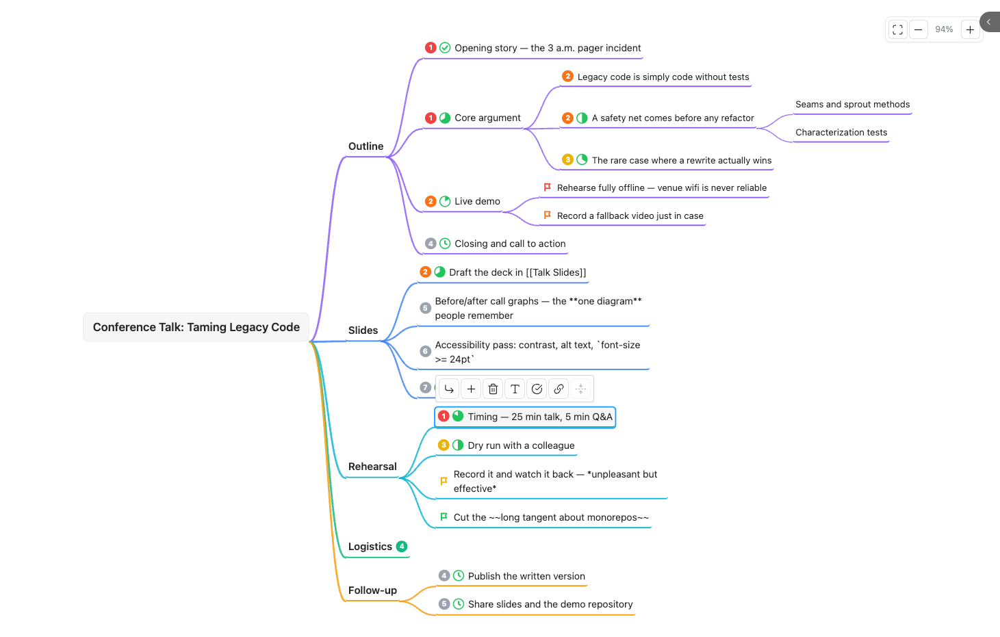

# Rich Mindmap

**English** · [简体中文](README.zh-CN.md)

An Obsidian plugin that turns an indented Markdown list into an editable mind map, with priority, progress and flag marks. The source of truth stays a plain `.md` file — the same structured Markdown you and any AI read and write.



*The [example file](examples/conference-talk.md) open in mindmap view.*

## How it differs from other mindmap plugins

Mindmap plugins in the Obsidian community mostly fall into two groups: **read-only previews** built on [markmap](https://markmap.js.org/) (they render a note as a mind map but you cannot edit on the map), and plugins built on Obsidian Canvas, whose data is `.canvas` JSON.

This plugin uses the same *hierarchy model* as markmap — headings plus nested lists — so a note you have been previewing with one of those plugins opens here and is editable on the map. It deliberately does **not** implement markmap's own dialect: the `markmap:` frontmatter options and the `<!-- markmap: fold -->` magic comments. Collapse state here lives in the `mindmap-collapsed` frontmatter key, and having two sources for it would force write-back to arbitrate between them — which conflicts with the promise that write-back does only the five normalizations listed below.

This one aims for:

- **Editing directly on the map**, while the data remains a plain Markdown indented list — no proprietary format, no coordinates, no JSON
- **Priority / progress / flag marks** written inline in the node text, readable and writable by both humans and AI
- **An explicit file-safety boundary**: only five byte-level normalizations are permitted (listed below), locked down by round-trip property tests

Editing is not unique to this plugin — several others manage it too. The mark system is, at the time of writing, uncommon in this category.

## Example

Copy [`examples/conference-talk.md`](examples/conference-talk.md) into your vault and open it in mindmap view. It exercises every feature: `##` / `###` sections forming the outer hierarchy, all seven priorities, all seven flag colours, progress across every stage, nested lists, wiki links, inline formatting, a parenthesized group that is *not* a mark, a collapsed heading recorded in `mindmap-collapsed`, plus frontmatter keys, a prose paragraph and an ordered list that the plugin carries along without showing.

```markdown
---
mindmap: true
tags:
  - talk
  - 2026
speaker: me
mindmap-collapsed:
  - Logistics
---

# Conference Talk: Taming Legacy Code

## Outline

- (p1 100%) Opening story — the 3 a.m. pager incident
- (p1 67%) Core argument
  - (p2) Legacy code is simply code without tests
  - (p2 50%) A safety net comes before any refactor
    - Seams and sprout methods
    - Characterization tests
  - (p3 33%) The rare case where a rewrite actually wins
- (p2 17%) Live demo
  - (flag:red) Rehearse fully offline — venue wifi is never reliable
  - (flag:orange) Record a fallback video just in case
- (p4 0%) Closing and call to action

## Slides

### Deck

- (p2 60%) Draft the deck in [[Talk Slides]]
- (p5) Before/after call graphs — the **one diagram** people remember

### Polish

- (p6) Accessibility pass: contrast, alt text, `font-size >= 24pt`
- (p7 0%) Speaker notes

## Rehearsal

Run through it three times; the third one is the one that counts.

- (p1 83%) Timing — 25 min talk, 5 min Q&A
- (p3 50%) Dry run with a colleague
- (flag:yellow) Record it and watch it back — *unpleasant but effective*
- (flag:green) Cut the ~~long tangent about monorepos~~

## Logistics

- (flag:blue) Flights booked
- (flag:purple) Hotel confirmation filed under [[Travel 2026]]
- (flag:gray) Expense report — after the trip
- (draft) this line opens with parentheses but is not a mark

## Follow-up

1. Ordered lists are carried along verbatim but never become nodes

- (p4 0%) Publish the written version
- (p5 0%) Share slides and the demo repository

## Notes

Headings and nested lists together form the hierarchy, so every `##` above is a
node on the map. What is *not* on the map: this paragraph, the `tags` and
`speaker` keys in the frontmatter, and the ordered list under Follow-up — all
carried along invisibly. Open this file in mindmap view, switch back to source,
and it should come back byte for byte identical.
```

## Installation

**From the community plugin browser (recommended)**

Settings → Community plugins → Browse, search for **Rich Mindmap**, install and enable it. The listing is at [community.obsidian.md/plugins/rich-mindmap](https://community.obsidian.md/plugins/rich-mindmap).

Requires Obsidian **1.8.7** or newer (the interface-language setting reads Obsidian's own language via an API added in that version).

**From a release**

Download `main.js`, `manifest.json` and `styles.css` from the [latest release](https://github.com/YounianC/obsidian-rich-mindmap/releases/latest), put all three into `<your vault>/.obsidian/plugins/rich-mindmap/`, then enable **Rich Mindmap** under Settings → Community plugins.

**From source**

```bash
git clone https://github.com/YounianC/obsidian-rich-mindmap.git
cd obsidian-rich-mindmap
npm install
npm run build          # produces main.js
```

Then copy (or symlink) `main.js`, `manifest.json` and `styles.css` into `<your vault>/.obsidian/plugins/rich-mindmap/`.

> `main.js` is a build artifact and is not committed — build it yourself or take it from a release.

## Data format

Top-of-line ATX headings (`#` through `######`) and nested unordered lists **together** form the hierarchy — the same hierarchy model [markmap](https://markmap.js.org/) uses, so notes written for a markmap-based preview plugin open here directly.

- If the file's first node line is a level-1 heading, it becomes the root node. Otherwise the root node takes its text from the file name, and the first heading in the file becomes a child of it.
- A heading of level L attaches to the nearest heading of level < L; if there is none, it attaches to the root. So `# T` followed by `### C` puts C under T (a level jump is fine), and a second `# X` in the same file attaches to the root rather than nesting.
- Within a heading, nested unordered lists work as before: indentation depth defines the hierarchy, and the indent unit is remembered per heading.

On a heading node, `Tab` adds a **list item** child, and `Enter` adds a **sibling heading** reusing the same `#` prefix. What a heading node cannot do:

- **It cannot be dragged.** Moving `## A` under `## B` would be written as `## B` followed by `## A`, which re-reads as A being B's *sibling* — the move would be silently undone. The format cannot express "an H2 nested inside an H2" without rewriting the `#` count, and rewriting it is not allowed.
- **It cannot be deleted while it carries content that is invisible on the map** (see the paragraph below). Deleting it would delete something you cannot see. When its only hidden content is a blank line, deletion is allowed and removes the whole section, subtree included.
- **The root node specifically cannot carry marks**, because a file without an H1 has no line to write them to.

Prose paragraphs, ordered lists, tables, code blocks and images under a heading are not shown on the map. They are carried along invisibly and replayed byte-for-byte on write-back — which is exactly why deleting a heading that carries them is refused.

### Inline marks

A parenthesized group at the very start of a node's text is parsed as marks **only if every space-separated token in it is a known mark**:

| Syntax | Meaning |
|---|---|
| `p1` … `p7` | Priority (p1 red, p2 orange, p3 yellow, p4+ grey) |
| `0%` … `100%` | Progress (mapped to a 7-stage pie; the value you wrote is preserved verbatim) |
| `flag:red` `flag:orange` `flag:yellow` `flag:green` `flag:blue` `flag:purple` `flag:gray` | Flag |

Combine them freely: `- (p1 60% flag:blue) node text`. Order does not matter when reading.

If the group contains anything unrecognised, the whole group is treated as ordinary text — `- (draft) some note` is not a mark.

Marks work on heading nodes too, written after the `#`: `## (p2) Slides`. **Be aware that this leaks outside the plugin** in a way marks on list items do not — heading text is addressable in Obsidian, so `(p2)` will show up in the Outline panel, in search results and in the graph, and adding a mark to a heading breaks any existing `[[note#heading]]` reference to it. The root node's H1 is the one exception: marks are refused there, because a file without an H1 has nowhere to write them.

### Inline formatting

After the marks group is stripped, the rest of a node's text is rendered as inline Markdown on the canvas:

| Syntax | Renders as |
|---|---|
| `**bold**` | bold |
| `*italic*` | italic (only `*` — `_` is left as a literal underscore, so `font_size` doesn't turn into emphasis) |
| `~~strikethrough~~` | strikethrough |
| `` `code` `` | inline code |
| `[[page]]` / `[[page|alias]]` | a clickable internal link |
| `[text](url)` | a clickable external link, opened in a new tab |

Unmatched or malformed markers (an unclosed `**`, a stray `*`) fall back to plain text — they are never dropped or turned into an error. `#tags` and raw HTML are **not** rendered; a node's text is preserved as-is (that's how `#tags` keep working elsewhere in your vault). There is no image support: `` is not recognised as an image syntax, so it degrades to a literal `!` followed by a plain clickable link to the image file — the same treatment any other `[text](url)` gets — not an embedded picture. This rendering is what the toolbar's bold/italic/strikethrough/link buttons write.

### Working with AI

The plugin embeds no AI. Point any AI at the `.md` file and let it edit directly — adding a node is one ordinary list item, with no ids, coordinates or JSON involved. When the file changes on disk the canvas re-parses and refreshes, keeping your viewport and selection where they were. If you had a local edit that had not yet been written to disk, the external content wins and a notice tells you so.

Content outside the list block — other frontmatter keys, preamble, code blocks, trailing paragraphs — is never rewritten.

### Write-back normalizations

Opening a file in mindmap view and switching away can cause Obsidian to rewrite it even if you changed nothing. That rewrite may produce these five byte-level changes and **only** these five:

1. A file not ending in a newline gains one.
2. A loose list (blank lines between items) becomes compact.
3. `CRLF` (`\r\n`) becomes `LF` (`\n`).
4. List indentation follows whatever the file already uses — 2 spaces, 4 spaces, tabs are all preserved, **and the unit is inferred per heading**, so different sections may use different units without being rewritten. Only two cases are rewritten to 2 spaces per level: one list block mixes indentation styles internally so that no one consistent unit can be inferred; or several list blocks under the *same* heading disagree, in which case they are unified to the first unit that could be inferred.
5. Inline marks are written in a fixed order: priority → progress → flag (`(flag:blue 60% p3)` becomes `(p3 60% flag:blue)`).

Everything else is byte-for-byte stable — including `*` and `+` list markers (never converted to `-`), the `#` count and surrounding whitespace of every heading line, trailing whitespace after the frontmatter fence, and every line that is not a node line.

### Known limits of the hierarchy parsing

- `##` with no space after it is a valid empty ATX heading in CommonMark, but is not recognised here. That space requirement is precisely why a line starting with `#tag` is not mistaken for a heading.
- A heading must start at column 0. CommonMark allows up to three leading spaces; those are not recognised, which is what keeps `  ## x` inside a list item's continuation from being mistaken for a heading.
- Setext headings (`A` followed by `===`) are not recognised.
- An ATX closing sequence is not stripped: `## A ##` yields the node text `A ##`. The bytes round-trip, but the text on the map carries the trailing `##`.
- A list block's boundary is "a run of consecutive list items"; prose between two items joins the earlier item's continuation without ending the block. So in `- a` / blank / prose / `    - b`, the `- b` is treated as a child of `a`, whereas CommonMark would have ended the list and read it as a code block. Same root cause as the pre-existing 4-space limitation.

### Parse failure

If a file cannot be parsed as a mind map, the canvas shows an error card with a "switch to source mode" button. In that state the plugin does not write to the file at all.

## Keyboard

| Key | Action |
|---|---|
| `Tab` | Add child node |
| `Enter` | Add sibling node |
| `F2` / double-click | Edit text |
| `Delete` / `Backspace` | Delete node and its subtree |
| Arrow keys | Move selection through the tree |
| `Space` | Collapse / expand |
| `Esc` | Cancel editing / clear selection |
| `Cmd/Ctrl` + wheel | Zoom |
| Drag empty space | Pan |

Dragging a node changes its parent and its position among siblings.

## Toolbar

Selecting a node brings up a floating toolbar next to it: bold / italic / strikethrough, the marks panel (priority, progress, flag — clicking an active item clears it), insert a `[[link]]`, and button equivalents for add child, add sibling, delete and collapse.

## Commands

- **New mindmap** (folder context menu) — creates `未命名思维导图.md` in that folder (auto-numbered `未命名思维导图 1.md`, `2`, … if taken), containing a `mindmap: true` frontmatter block plus an H1 matching the file name, then opens it in mindmap view in the current pane. The H1 is there so the root node can be renamed directly in the map; renaming the file afterwards does not update the root text.
- **Toggle mindmap / source view** — the mindmap view also has a "switch to source" icon button in its header (top right) that does the same thing. Switching back to source manually is not undone by auto-open; the file only re-enters mindmap view the next time it is opened.
- **Mark as mindmap (write frontmatter)** — writes `mindmap: true` so the file opens in mindmap view from then on (can be turned off in settings). On a file with no frontmatter it creates one. This command also normalizes the whole file's line endings to `LF` (normalization 3 above); visible content is unaffected.

## Language

The interface is available in English and Simplified Chinese. Settings → Rich Mindmap → **Interface language** offers three choices: **Follow Obsidian** (the default — it shows the language code it detected in parentheses), **简体中文**, and **English**. Switching takes effect immediately, including the names in the command palette.

The default name of a file created by **New mindmap** follows the language too (`Untitled Mindmap.md` / `未命名思维导图.md`). Existing files are never renamed.

Two limits worth knowing: `zh-TW` and `zh-HK` fall back to Simplified Chinese, and the plugin description in `manifest.json` is English only — Obsidian does not support localized manifests.

## Development

```bash
npm install
npm run dev            # esbuild watch
npm test               # vitest
npm run typecheck
npm run check:purity
npm run check:i18n
```

`src/model/` (`collapse-state.ts`, `marks.ts`, `parser.ts`, `serializer.ts`, `tree-ops.ts`, `types.ts`) plus `src/view/layout.ts` and `src/view/camera.ts` form a pure-function layer with no dependency on the Obsidian API or the DOM. `npm run check:purity` enforces that boundary; all of it is unit tested.

## Releasing

Pushing a version tag builds and publishes a release automatically:

```bash
# 1. Bump version in manifest.json and add the matching entry to versions.json
# 2. Tag it — the name must equal manifest.version exactly, with no v prefix
git tag -a 0.2.0 -m "..."
git push origin 0.2.0
```

GitHub Actions runs the type check, unit tests, purity check and build, and only then creates the release with `main.js`, `manifest.json` and `styles.css` attached.

## Project status

`0.1.1` is the version in the community plugin browser. `0.2.0` — the interface-language setting, which also raises the Obsidian requirement to 1.8.7 — is prepared in this repository but not released yet.

- The pure-function layer (parsing, serialization, marks, collapse state, tree operations, layout, camera, i18n) has 341 automated tests, including Markdown round-trip property tests.
- The view layer (rendering, zoom/pan, keyboard, drag, toolbar) is verified **by hand** by design — being published does not change that. The checklist lives in [docs/MANUAL-VERIFICATION.md](docs/MANUAL-VERIFICATION.md); the "does it open, render and leave the file alone" section and all 16 🔴 high-risk items have passed, **the remaining sections have not been worked through yet**. Its appendix lists the defects found and fixed during development — that is where regressions are most likely.

Because the plugin rewrites your notes, **verify write-back behaviour in a test vault or a git-tracked directory first**, and only point it at notes you care about once you are satisfied.

## Documentation

- [AGENTS.md](AGENTS.md) — guide for AI agents working in this repo: architecture boundaries, ten hard constraints, the gates, and what the automated checks cannot see
- [docs/MANUAL-VERIFICATION.md](docs/MANUAL-VERIFICATION.md) — 92-item manual verification checklist
- [docs/superpowers/specs/](docs/superpowers/specs/) — design and decision record, including known limitations

## License

[MIT](LICENSE)
